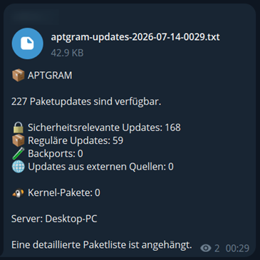
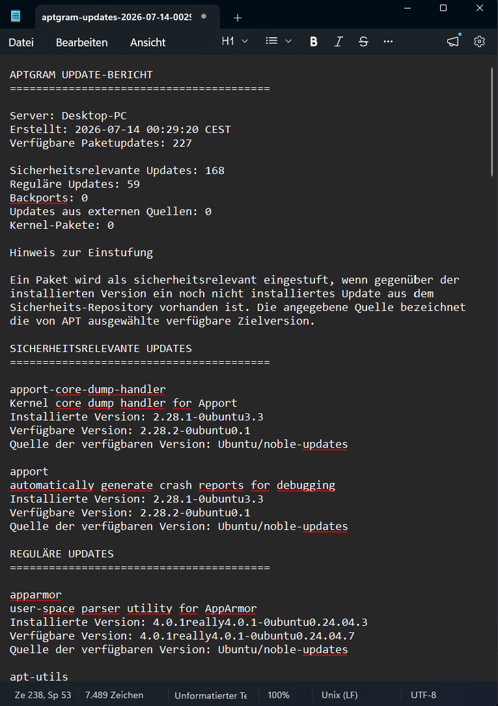

<p align="center">
  
</p>

<h1 align="center">APTGRAM</h1>

<p align="center">
  <strong>APT package update monitoring with Telegram notifications.</strong>
</p>

<p align="center">
  Monitor available APT updates, classify security and repository sources,
  and receive clear reports directly in Telegram.
</p>

<p align="center">
  Designed for <strong>Debian-based Linux systems</strong>
  using <strong>systemd</strong> and the <strong>APT package manager</strong>.
</p>

<p align="center">
  Created by <strong>Sven Hüttmann</strong><br>
  <a href="https://madebyzwen.dev">madebyzwen.dev</a>
</p>

---

## Preview

<p align="center">
  <strong>
    APTGRAM delivers a compact update overview directly to Telegram
    and attaches a detailed plain-text package report.
  </strong>
</p>

<table>
  <tr>
    <td width="50%" align="center" valign="top">
      
      <br><br>
      <strong>Telegram Update Overview</strong>
      <br>
      <sub>
        Available updates are classified by security relevance,
        regular updates, backports, external sources, and kernel packages.
      </sub>
    </td>
    <td width="50%" align="center" valign="top">
      
      <br><br>
      <strong>Detailed Package Report</strong>
      <br>
      <sub>
        A full plain-text report lists packages, installed and available
        versions, package summaries, and the source of each candidate version.
      </sub>
    </td>
  </tr>
</table>

---

<a id="documentation-languages"></a>

<h2 align="center">Documentation</h2>

<p align="center">
  <a href="#english">English</a> ·
  <a href="#francais">Français</a> ·
  <a href="#deutsch">Deutsch</a> ·
  <a href="#italiano">Italiano</a> ·
  <a href="#portugues-brasil">Português (Brasil)</a> ·
  <a href="#espanol">Español</a>
</p>

---

<a id="english"></a>

## English

### Features

APTGRAM monitors available APT package updates and sends clear update notifications directly to Telegram.

It provides:

- Automatic APT package list refresh
- Detection of available package updates
- Classification of security updates
- Classification of regular updates
- Detection of backports
- Detection of updates from external repositories
- Detection of kernel-related package updates
- Repository origin and archive analysis
- Package summary collection
- Detailed plain-text update reports
- Telegram update notifications
- Update reports sent as Telegram documents
- Weekly heartbeat notifications to confirm that APTGRAM is still running and able to reach Telegram
- Multi-language installer, notifications, and reports
- Secure Telegram bot token handling using systemd credentials
- Support for encrypted systemd credentials where available
- Automatic execution using a systemd timer

### Heartbeat

APTGRAM sends a weekly heartbeat message to Telegram.

The heartbeat acts as a simple health indicator and confirms that APTGRAM is still running and able to communicate with Telegram, even when there are no update notifications to send.

### Supported Languages

APTGRAM currently supports the following languages:

- English (`en`)
- French (`fr`)
- German (`de`)
- Italian (`it`)
- Portuguese — Brazil (`pt_BR`)
- Spanish (`es`)

The selected language is used throughout APTGRAM, including the installer, Telegram update notifications, weekly heartbeat messages, and generated update reports.

The installer automatically detects the system language where possible and allows the user to select a different supported language during setup.

### Localization Tools

APTGRAM includes development tools for maintaining its language files:

- Validation of locale variable completeness
- Detection of missing translation variables per locale
- Consistent sorting of locale variables
- Interactive addition of new locale variables and translations

All locale files are expected to contain the same set of translation variables.

[Back to language selection](#documentation-languages)

---

<a id="francais"></a>

## Français

### Fonctionnalités

APTGRAM surveille les mises à jour de paquets APT disponibles et envoie des notifications claires directement dans Telegram.

Il propose les fonctionnalités suivantes :

- Actualisation automatique des listes de paquets APT
- Détection des mises à jour de paquets disponibles
- Classification des mises à jour de sécurité
- Classification des mises à jour régulières
- Détection des backports
- Détection des mises à jour provenant de dépôts externes
- Détection des mises à jour de paquets liées au noyau
- Analyse de l'origine et de l'archive des dépôts
- Collecte des résumés de paquets
- Rapports détaillés de mises à jour en texte brut
- Notifications de mises à jour via Telegram
- Envoi des rapports de mises à jour sous forme de documents Telegram
- Notifications heartbeat hebdomadaires confirmant qu'APTGRAM fonctionne toujours et peut joindre Telegram
- Programme d'installation, notifications et rapports multilingues
- Gestion sécurisée du token du bot Telegram à l'aide des credentials systemd
- Prise en charge des credentials systemd chiffrés lorsqu'ils sont disponibles
- Exécution automatique à l'aide d'un timer systemd

### Heartbeat

APTGRAM envoie un message heartbeat hebdomadaire dans Telegram.

Le heartbeat sert d'indicateur de fonctionnement simple et confirme qu'APTGRAM est toujours actif et capable de communiquer avec Telegram, même lorsqu'aucune notification de mise à jour ne doit être envoyée.

### Langues prises en charge

APTGRAM prend actuellement en charge les langues suivantes :

- Anglais (`en`)
- Français (`fr`)
- Allemand (`de`)
- Italien (`it`)
- Portugais — Brésil (`pt_BR`)
- Espagnol (`es`)

La langue sélectionnée est utilisée dans l'ensemble d'APTGRAM, notamment dans le programme d'installation, les notifications de mises à jour Telegram, les messages heartbeat hebdomadaires et les rapports de mises à jour générés.

Le programme d'installation détecte automatiquement la langue du système lorsque cela est possible et permet à l'utilisateur de sélectionner une autre langue prise en charge pendant la configuration.

### Outils de localisation

APTGRAM comprend des outils de développement pour gérer ses fichiers de langue :

- Validation de l'exhaustivité des variables de langue
- Détection des variables de traduction manquantes pour chaque langue
- Tri cohérent des variables de langue
- Ajout interactif de nouvelles variables de langue et de leurs traductions

Tous les fichiers de langue doivent contenir le même ensemble de variables de traduction.

[Retour à la sélection de la langue](#documentation-languages)

---

<a id="deutsch"></a>

## Deutsch

### Funktionen

APTGRAM überwacht verfügbare APT-Paketupdates und sendet übersichtliche Update-Benachrichtigungen direkt an Telegram.

APTGRAM bietet:

- Automatische Aktualisierung der APT-Paketlisten
- Erkennung verfügbarer Paketupdates
- Klassifizierung von Sicherheitsupdates
- Klassifizierung regulärer Updates
- Erkennung von Backports
- Erkennung von Updates aus externen Paketquellen
- Erkennung von Kernel-bezogenen Paketupdates
- Analyse von Repository-Herkunft und Archiv
- Erfassung von Paketbeschreibungen
- Detaillierte Update-Berichte als reine Textdateien
- Update-Benachrichtigungen über Telegram
- Versand von Update-Berichten als Telegram-Dokumente
- Wöchentliche Heartbeat-Benachrichtigungen zur Bestätigung, dass APTGRAM weiterhin läuft und Telegram erreichen kann
- Mehrsprachiger Installer, Benachrichtigungen und Berichte
- Sichere Verwaltung des Telegram-Bot-Tokens über systemd-Credentials
- Unterstützung verschlüsselter systemd-Credentials, sofern verfügbar
- Automatische Ausführung über einen systemd-Timer

### Heartbeat

APTGRAM sendet einmal pro Woche eine Heartbeat-Nachricht an Telegram.

Der Heartbeat dient als einfacher Funktionsindikator und bestätigt, dass APTGRAM weiterhin läuft und mit Telegram kommunizieren kann, auch wenn keine Update-Benachrichtigungen versendet werden müssen.

### Unterstützte Sprachen

APTGRAM unterstützt derzeit die folgenden Sprachen:

- Englisch (`en`)
- Französisch (`fr`)
- Deutsch (`de`)
- Italienisch (`it`)
- Portugiesisch — Brasilien (`pt_BR`)
- Spanisch (`es`)

Die ausgewählte Sprache wird in APTGRAM durchgängig verwendet. Dazu gehören der Installer, Telegram-Update-Benachrichtigungen, wöchentliche Heartbeat-Nachrichten und generierte Update-Berichte.

Der Installer erkennt nach Möglichkeit automatisch die Systemsprache und ermöglicht während der Einrichtung die Auswahl einer anderen unterstützten Sprache.

### Lokalisierungswerkzeuge

APTGRAM enthält Entwicklungswerkzeuge zur Pflege der Sprachdateien:

- Prüfung der Vollständigkeit von Locale-Variablen
- Erkennung fehlender Übersetzungsvariablen pro Sprache
- Einheitliche Sortierung der Locale-Variablen
- Interaktives Hinzufügen neuer Locale-Variablen und Übersetzungen

Alle Locale-Dateien müssen denselben Satz an Übersetzungsvariablen enthalten.

## Installation

APTGRAM ist für Debian-basierte Linux-Systeme mit `systemd` und APT-Paketverwaltung entwickelt.

Dazu gehören zum Beispiel:

- Debian
- Ubuntu
- Debian-basierte Server-Systeme
- kompatible UGREEN NAS-Systeme mit UGOS Pro

Für die Installation benötigst du außerdem:

- einen Telegram-Bot
- einen Telegram-Kanal für die APTGRAM-Benachrichtigungen
- den **Telegram Bot Token**
- die numerische **Telegram Chat ID** des Kanals

Du hast noch nie einen Telegram-Bot eingerichtet?

Kein Problem. Die folgenden Schritte führen dich vollständig durch die Einrichtung.

---

### 1. Telegram-Bot erstellen

Öffne Telegram und suche nach:

```text
@BotFather
```

Achte darauf, den offiziellen BotFather von Telegram zu verwenden.

Öffne den Chat und sende:

```text
/newbot
```

BotFather führt dich nun durch die Erstellung deines Bots.

#### Bot-Namen festlegen

Zuerst fragt BotFather nach einem Namen für den Bot.

Dieser Name wird später in Telegram angezeigt.

Beispiel:

```text
APTGRAM Server
```

Der Name kann frei gewählt werden.

#### Bot-Benutzernamen festlegen

Anschließend benötigt der Bot einen eindeutigen Benutzernamen.

Der Benutzername muss auf `bot` enden.

Beispiel:

```text
my_aptgram_bot
```

Ist der Benutzername bereits vergeben, musst du einen anderen Namen wählen.

Nach erfolgreicher Erstellung zeigt BotFather den **Telegram Bot Token** an.

Ein Bot Token sieht ungefähr so aus:

```text
1234567890:AAExampleTokenDoNotUseThisValue
```

Kopiere den vollständigen Token.

Du benötigst ihn später während der APTGRAM-Installation.

> [!IMPORTANT]
> Der Telegram Bot Token ist ein Geheimnis und muss wie ein Passwort behandelt werden.
>
> Veröffentliche den Token niemals in einem GitHub-Issue, Screenshot, Forum, Terminal-Log oder Chat.
>
> Falls ein Token versehentlich veröffentlicht wurde, widerrufe ihn sofort über `@BotFather` und erstelle einen neuen Token.

<!-- SCREENSHOT 1
Datei: docs/images/telegram-botfather-token.png
Inhalt: BotFather nach erfolgreicher Bot-Erstellung.
Der echte Token muss im Screenshot vollständig unkenntlich gemacht werden.
-->

---

### 2. Telegram-Kanal erstellen

Erstelle in Telegram einen neuen Kanal.

Der Name des Kanals ist frei wählbar.

Beispiel:

```text
APTGRAM Updates
```

Der Kanal kann öffentlich oder privat sein.

APTGRAM benötigt lediglich die Möglichkeit, Nachrichten über den zuvor erstellten Bot in diesem Kanal zu veröffentlichen.

---

### 3. Telegram-Bot als Administrator hinzufügen

Öffne die Einstellungen deines Telegram-Kanals.

Suche dort nach:

```text
Administratoren
```

oder bei englischer Telegram-Oberfläche:

```text
Administrators
```

Füge anschließend den zuvor erstellten Bot als Administrator hinzu.

Suche dazu nach seinem Benutzernamen.

Beispiel:

```text
@my_aptgram_bot
```

Der Bot benötigt mindestens die Berechtigung, Nachrichten im Kanal zu veröffentlichen.

Andere Administratorrechte werden von APTGRAM nicht benötigt.

<!-- SCREENSHOT 2
Datei: docs/images/telegram-channel-admin.png
Inhalt: Telegram-Kanalverwaltung mit dem APTGRAM-Bot als Administrator.
Die Berechtigung zum Veröffentlichen von Nachrichten sollte sichtbar sein.
-->

Nachdem der Bot hinzugefügt wurde, sende selbst eine neue Nachricht in den Kanal.

Zum Beispiel:

```text
APTGRAM setup
```

Wichtig ist, dass diese Nachricht **nach dem Hinzufügen des Bots** gesendet wird.

Telegram kann dadurch dem Bot ein neues Kanal-Update bereitstellen.

---

### 4. Telegram Chat ID des Kanals ermitteln

APTGRAM benötigt die numerische Chat ID des Telegram-Kanals.

Eine Kanal-ID sieht zum Beispiel so aus:

```text
-1001234567890
```

Öffne auf dem Debian-basierten Linux-System, auf dem APTGRAM installiert werden soll, ein Terminal.

Kopiere den folgenden Befehl vollständig in das Terminal:

```bash
read -rsp "Telegram Bot Token: " BOT_TOKEN
printf '\n'

printf 'url = "https://api.telegram.org/bot%s/getUpdates"\n' "${BOT_TOKEN}" |
    curl \
        --disable \
        --silent \
        --show-error \
        --config - |
    grep -o -- '-100[0-9]\+' |
    sort -u

unset BOT_TOKEN
```

Das Terminal fragt nun nach:

```text
Telegram Bot Token:
```

Füge den Bot Token ein, den du von `@BotFather` erhalten hast.

Während der Eingabe werden keine Zeichen angezeigt.

Das ist normal und verhindert, dass der Token offen im Terminal dargestellt wird.

Drücke anschließend `Enter`.

Nun sollte die numerische Chat ID deines Telegram-Kanals angezeigt werden.

Beispiel:

```text
-1001234567890
```

Kopiere die vollständige Nummer einschließlich des Minuszeichens.

Du benötigst sie gleich während der APTGRAM-Installation.

<!-- SCREENSHOT 3
Datei: docs/images/telegram-chat-id.png
Inhalt: Terminal nach erfolgreicher Ermittlung der Chat ID.
Der Bot Token darf nicht sichtbar sein.
Die ausgegebene -100... Chat ID darf sichtbar sein.
-->

#### Es wird keine Chat ID angezeigt?

Prüfe zunächst folgende Punkte:

1. Der Bot wurde dem richtigen Telegram-Kanal hinzugefügt.
2. Der Bot ist Administrator des Kanals.
3. Der Bot darf Nachrichten veröffentlichen.
4. Nach dem Hinzufügen des Bots wurde eine neue Nachricht im Kanal veröffentlicht.

Sende anschließend erneut eine Nachricht in den Telegram-Kanal.

Führe danach den Befehl zur Ermittlung der Chat ID noch einmal aus.

---

### 5. APTGRAM herunterladen

Öffne ein Terminal auf dem System, auf dem APTGRAM installiert werden soll.

Falls `git` noch nicht installiert ist, kannst du es unter Debian-basierten Systemen mit folgendem Befehl installieren:

```bash
sudo apt update
sudo apt install git
```

Klone anschließend das APTGRAM-Repository von GitHub:

```bash
git clone https://github.com/madebyzwen/aptgram.git
```

Wechsle in das heruntergeladene Projektverzeichnis:

```bash
cd aptgram
```

---

### 6. APTGRAM installieren

Starte den Installer mit:

```bash
bash install.sh
```

Der Installer sollte nicht mit `sudo bash install.sh` gestartet werden.

APTGRAM fordert selbst `sudo`-Berechtigungen an, sobald diese für die Installation benötigt werden.

Beim Start erkennt APTGRAM automatisch die Sprache des Systems.

Beispiel:

```text
APTGRAM Installation
==============================

Erkannte Sprache: Deutsch

Möchtest du die Sprache ändern? [j/N]
```

Drücke einfach `Enter`, um die erkannte Sprache zu verwenden.

Alternativ kannst du die Sprache während der Installation ändern.

---

### 7. Telegram Bot Token eingeben

APTGRAM fragt nach dem Telegram Bot Token:

```text
Telegram Bot Token:
```

Füge den vollständigen Token ein, den du zuvor von `@BotFather` erhalten hast.

APTGRAM prüft den Token direkt über Telegram.

Bei einem gültigen Token erscheint:

```text
Bot Token wird geprüft...
Bot Token erfolgreich geprüft.
```

Ist der Token ungültig, fordert APTGRAM dich zur erneuten Eingabe auf.

---

### 8. Telegram Chat ID eingeben

Anschließend fragt APTGRAM nach der Telegram Chat ID:

```text
Telegram Chat ID:
```

Füge die zuvor ermittelte Kanal-ID ein.

Beispiel:

```text
-1001234567890
```

Das Minuszeichen am Anfang gehört zur Chat ID und darf nicht entfernt werden.

APTGRAM testet anschließend automatisch die Verbindung zu Telegram.

Bei erfolgreicher Verbindung erscheint:

```text
Telegram-Verbindung wird getestet...
Telegram-Verbindung erfolgreich.
```

Öffne jetzt deinen Telegram-Kanal.

Dort sollte eine Testnachricht von APTGRAM angekommen sein.

<!-- SCREENSHOT 4
Datei: docs/images/telegram-test-message.png
Inhalt: Telegram-Kanal mit der erfolgreichen APTGRAM-Testnachricht.
Idealerweise Bot-Name und Testnachricht sichtbar.
-->

Wurde die Testnachricht empfangen, ist die Telegram-Konfiguration erfolgreich abgeschlossen.

---

### 9. Tägliche Prüfzeit festlegen

APTGRAM fragt nun nach der Uhrzeit für die tägliche Update-Prüfung.

Standardmäßig wird `20:00` Uhr vorgeschlagen:

```text
Tägliche Prüfzeit [20:00]:
```

Drücke einfach `Enter`, um die Standardzeit zu übernehmen.

Alternativ kannst du eine eigene Uhrzeit im 24-Stunden-Format eingeben.

Beispiel:

```text
06:30
```

APTGRAM führt den automatischen Update-Check dann täglich zu dieser Uhrzeit aus.

---

### 10. Konfiguration prüfen

Vor der eigentlichen Installation zeigt APTGRAM eine Zusammenfassung der Konfiguration an.

Beispiel:

```text
Konfiguration
==============================

Sprache: Deutsch
Telegram Chat ID: -1001234567890
Tägliche Prüfung: 20:00
Telegram Bot Token: erfolgreich geprüft
```

Der vollständige Telegram Bot Token wird in dieser Zusammenfassung nicht erneut benötigt.

---

### 11. Automatische Installation

APTGRAM führt nun die restliche Installation automatisch durch.

Dabei werden:

- die APTGRAM-Programmdateien installiert
- die APTGRAM-Bibliotheken installiert
- die Sprachdateien installiert
- die ausgewählte Sprache gespeichert
- die Telegram Chat ID gespeichert
- der Telegram Bot Token geschützt als systemd-Credential gespeichert
- ein `systemd`-Service eingerichtet
- ein `systemd`-Timer eingerichtet
- der Timer automatisch aktiviert
- ein erster APTGRAM-Prüflauf gestartet

Während der Installation erscheinen entsprechende Statusmeldungen.

Beispiel:

```text
APTGRAM-Dateien werden installiert...

systemd-Service und Timer werden installiert...

APTGRAM-Timer wird aktiviert...

Erster APTGRAM-Prüflauf wird gestartet...
```

Nach erfolgreicher Installation erscheint:

```text
APTGRAM wurde erfolgreich installiert.
```

---

### 12. Ersten APTGRAM-Bericht prüfen

Direkt nach der Installation startet APTGRAM automatisch einen ersten Prüflauf.

Sind Paketupdates verfügbar, sendet APTGRAM eine Übersicht an den konfigurierten Telegram-Kanal.

Die Nachricht enthält unter anderem die Anzahl der:

- Sicherheitsupdates
- regulären Updates
- Backports
- Updates aus externen Paketquellen
- Kernel-Updates

Zusätzlich sendet APTGRAM einen detaillierten Update-Bericht als Textdatei an den Telegram-Kanal.

Damit ist gleichzeitig geprüft, dass:

- APT korrekt abgefragt werden kann
- Updates erkannt werden
- Paketquellen analysiert werden
- Telegram erreichbar ist
- der Bot Nachrichten senden kann
- Dateianhänge an Telegram übertragen werden können

---

### 13. APTGRAM-Installation prüfen

Prüfe, ob der APTGRAM-Timer aktiviert ist:

```bash
systemctl is-enabled aptgram.timer
```

Die erwartete Ausgabe lautet:

```text
enabled
```

Die nächste geplante Ausführung kannst du mit folgendem Befehl anzeigen:

```bash
systemctl list-timers aptgram.timer
```

Die letzten Meldungen des APTGRAM-Service können mit folgendem Befehl angezeigt werden:

```bash
journalctl -u aptgram.service --no-pager -n 50
```

> [!NOTE]
> `aptgram.service` ist ein `oneshot`-Service.
>
> Der Service führt den APTGRAM-Prüflauf aus und beendet sich anschließend wieder.
>
> Deshalb bleibt der Service nach einem erfolgreichen Prüflauf nicht dauerhaft als `active (running)` aktiv. Das ist normal.

---

## Deinstallation

APTGRAM installiert automatisch einen eigenen Uninstaller.

Die vollständige Deinstallation wird mit folgendem Befehl gestartet:

```bash
sudo aptgram-uninstall
```

APTGRAM fragt vor der Deinstallation nach einer Bestätigung.

Beispiel:

```text
APTGRAM Deinstallation
==============================

Möchtest du APTGRAM vollständig entfernen? [j/N]
```

Bestätige die Deinstallation mit:

```text
j
```

Der Uninstaller:

- stoppt den APTGRAM-Timer
- deaktiviert den APTGRAM-Timer
- stoppt den APTGRAM-Service
- entfernt die `systemd`-Units
- entfernt die APTGRAM-Programmdateien
- entfernt die APTGRAM-Bibliotheken
- entfernt die Sprachdateien
- entfernt die APTGRAM-Konfiguration
- entfernt die gespeicherten Telegram-Credentials
- entfernt den APTGRAM-Uninstaller

Nach erfolgreicher Deinstallation erscheint:

```text
APTGRAM wurde vollständig entfernt.
```

APTGRAM hinterlässt anschließend keine installierten Programmdateien, Konfigurationsdateien oder `systemd`-Units auf dem System.

[Zurück zur Sprachauswahl](#documentation-languages)

---

<a id="italiano"></a>

## Italiano

### Funzionalità

APTGRAM monitora gli aggiornamenti disponibili dei pacchetti APT e invia notifiche chiare direttamente su Telegram.

APTGRAM offre:

- Aggiornamento automatico degli elenchi dei pacchetti APT
- Rilevamento degli aggiornamenti dei pacchetti disponibili
- Classificazione degli aggiornamenti di sicurezza
- Classificazione degli aggiornamenti regolari
- Rilevamento dei backport
- Rilevamento degli aggiornamenti provenienti da repository esterni
- Rilevamento degli aggiornamenti dei pacchetti relativi al kernel
- Analisi dell'origine e dell'archivio dei repository
- Raccolta dei riepiloghi dei pacchetti
- Report dettagliati degli aggiornamenti in formato testo semplice
- Notifiche degli aggiornamenti tramite Telegram
- Invio dei report degli aggiornamenti come documenti Telegram
- Notifiche heartbeat settimanali per confermare che APTGRAM sia ancora in esecuzione e possa raggiungere Telegram
- Installer, notifiche e report multilingue
- Gestione sicura del token del bot Telegram tramite credenziali systemd
- Supporto per credenziali systemd crittografate, quando disponibili
- Esecuzione automatica tramite un timer systemd

### Heartbeat

APTGRAM invia un messaggio heartbeat settimanale su Telegram.

L'heartbeat funge da semplice indicatore di funzionamento e conferma che APTGRAM sia ancora attivo e in grado di comunicare con Telegram, anche quando non ci sono notifiche di aggiornamento da inviare.

### Lingue supportate

APTGRAM supporta attualmente le seguenti lingue:

- Inglese (`en`)
- Francese (`fr`)
- Tedesco (`de`)
- Italiano (`it`)
- Portoghese — Brasile (`pt_BR`)
- Spagnolo (`es`)

La lingua selezionata viene utilizzata in tutto APTGRAM, inclusi l'installer, le notifiche degli aggiornamenti Telegram, i messaggi heartbeat settimanali e i report degli aggiornamenti generati.

L'installer rileva automaticamente la lingua del sistema quando possibile e consente all'utente di selezionare un'altra lingua supportata durante la configurazione.

### Strumenti di localizzazione

APTGRAM include strumenti di sviluppo per la manutenzione dei file di lingua:

- Verifica della completezza delle variabili di localizzazione
- Rilevamento delle variabili di traduzione mancanti per ogni lingua
- Ordinamento coerente delle variabili di localizzazione
- Aggiunta interattiva di nuove variabili di localizzazione e traduzioni

Tutti i file di lingua devono contenere lo stesso insieme di variabili di traduzione.

[Torna alla selezione della lingua](#documentation-languages)

---

<a id="portugues-brasil"></a>

## Português (Brasil)

### Recursos

O APTGRAM monitora as atualizações disponíveis de pacotes APT e envia notificações claras diretamente para o Telegram.

O APTGRAM oferece:

- Atualização automática das listas de pacotes APT
- Detecção de atualizações de pacotes disponíveis
- Classificação de atualizações de segurança
- Classificação de atualizações regulares
- Detecção de backports
- Detecção de atualizações provenientes de repositórios externos
- Detecção de atualizações de pacotes relacionadas ao kernel
- Análise da origem e do arquivo dos repositórios
- Coleta de resumos dos pacotes
- Relatórios detalhados de atualizações em texto simples
- Notificações de atualizações pelo Telegram
- Envio de relatórios de atualização como documentos do Telegram
- Notificações heartbeat semanais para confirmar que o APTGRAM continua em execução e consegue acessar o Telegram
- Instalador, notificações e relatórios multilíngues
- Gerenciamento seguro do token do bot do Telegram usando credenciais do systemd
- Suporte a credenciais criptografadas do systemd, quando disponíveis
- Execução automática usando um timer do systemd

### Heartbeat

O APTGRAM envia uma mensagem heartbeat semanal para o Telegram.

O heartbeat funciona como um indicador simples de funcionamento e confirma que o APTGRAM continua ativo e consegue se comunicar com o Telegram, mesmo quando não há notificações de atualização para enviar.

### Idiomas suportados

O APTGRAM atualmente oferece suporte aos seguintes idiomas:

- Inglês (`en`)
- Francês (`fr`)
- Alemão (`de`)
- Italiano (`it`)
- Português — Brasil (`pt_BR`)
- Espanhol (`es`)

O idioma selecionado é usado em todo o APTGRAM, incluindo o instalador, as notificações de atualização do Telegram, as mensagens heartbeat semanais e os relatórios de atualização gerados.

O instalador detecta automaticamente o idioma do sistema quando possível e permite que o usuário selecione outro idioma compatível durante a configuração.

### Ferramentas de localização

O APTGRAM inclui ferramentas de desenvolvimento para manutenção dos arquivos de idioma:

- Validação da integridade das variáveis de localização
- Detecção de variáveis de tradução ausentes por idioma
- Ordenação consistente das variáveis de localização
- Adição interativa de novas variáveis de localização e traduções

Todos os arquivos de idioma devem conter o mesmo conjunto de variáveis de tradução.

[Voltar para a seleção de idioma](#documentation-languages)

---

<a id="espanol"></a>

## Español

### Funciones

APTGRAM supervisa las actualizaciones disponibles de paquetes APT y envía notificaciones claras directamente a Telegram.

APTGRAM ofrece:

- Actualización automática de las listas de paquetes APT
- Detección de actualizaciones de paquetes disponibles
- Clasificación de actualizaciones de seguridad
- Clasificación de actualizaciones regulares
- Detección de backports
- Detección de actualizaciones procedentes de repositorios externos
- Detección de actualizaciones de paquetes relacionadas con el kernel
- Análisis del origen y del archivo de los repositorios
- Recopilación de resúmenes de paquetes
- Informes detallados de actualizaciones en texto sin formato
- Notificaciones de actualizaciones mediante Telegram
- Envío de informes de actualización como documentos de Telegram
- Notificaciones heartbeat semanales para confirmar que APTGRAM sigue funcionando y puede conectarse con Telegram
- Instalador, notificaciones e informes multilingües
- Gestión segura del token del bot de Telegram mediante credenciales de systemd
- Compatibilidad con credenciales cifradas de systemd cuando estén disponibles
- Ejecución automática mediante un temporizador de systemd

### Heartbeat

APTGRAM envía un mensaje heartbeat semanal a Telegram.

El heartbeat actúa como un sencillo indicador de funcionamiento y confirma que APTGRAM sigue activo y puede comunicarse con Telegram, incluso cuando no hay notificaciones de actualizaciones que enviar.

### Idiomas compatibles

APTGRAM admite actualmente los siguientes idiomas:

- Inglés (`en`)
- Francés (`fr`)
- Alemán (`de`)
- Italiano (`it`)
- Portugués — Brasil (`pt_BR`)
- Español (`es`)

El idioma seleccionado se utiliza en todo APTGRAM, incluido el instalador, las notificaciones de actualizaciones de Telegram, los mensajes heartbeat semanales y los informes de actualizaciones generados.

El instalador detecta automáticamente el idioma del sistema cuando es posible y permite al usuario seleccionar otro idioma compatible durante la configuración.

### Herramientas de localización

APTGRAM incluye herramientas de desarrollo para mantener sus archivos de idioma:

- Validación de la integridad de las variables de localización
- Detección de variables de traducción ausentes por idioma
- Ordenación coherente de las variables de localización
- Adición interactiva de nuevas variables de localización y traducciones

Todos los archivos de idioma deben contener el mismo conjunto de variables de traducción.

[Volver a la selección de idioma](#documentation-languages)

---

<p align="center">
  Created by <strong>Sven Hüttmann</strong>
  ·
  <a href="https://madebyzwen.dev">madebyzwen.dev</a>
</p>