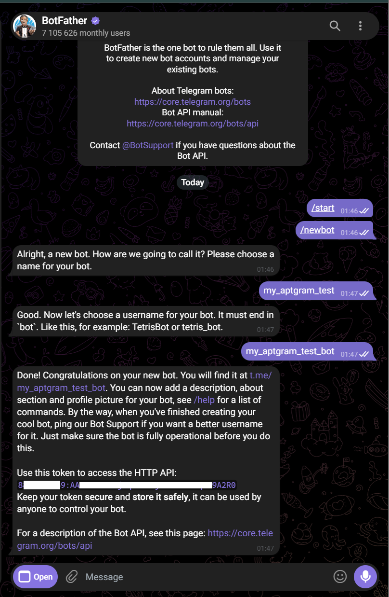
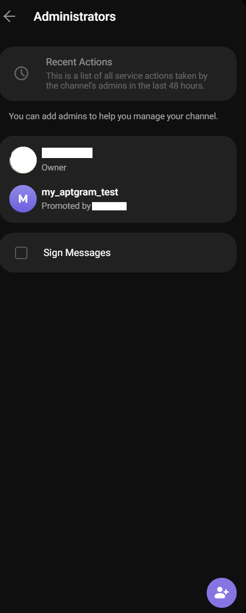
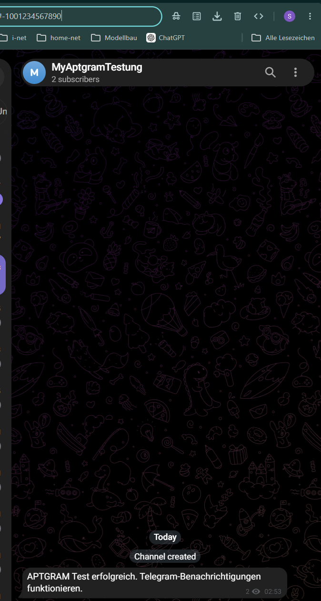

# APTGRAM – Instalação em português do Brasil

[← Voltar ao README](../README.md)

Este guia explica passo a passo como configurar o bot do Telegram, o canal do Telegram e instalar o APTGRAM.

## Instalação

O APTGRAM foi desenvolvido para sistemas Linux baseados em Debian com `systemd` e o gerenciador de pacotes APT.

Isso inclui, por exemplo:

- Debian
- Ubuntu
- sistemas de servidor baseados em Debian
- sistemas NAS UGREEN compatíveis com UGOS Pro

Você também precisará de:

- um bot do Telegram
- um canal do Telegram para as notificações do APTGRAM
- o **Telegram Bot Token**
- o **Telegram Chat ID** numérico do canal

Nunca configurou um bot do Telegram?

Sem problema. As etapas a seguir orientam você durante toda a configuração.

---

### 1. Criar um bot do Telegram

Abra o Telegram e procure por:

```text
@BotFather
```

Certifique-se de usar o BotFather oficial do Telegram.

Abra a conversa e envie:

```text
/newbot
```

O BotFather orientará você durante a criação do bot.

#### Definir o nome do bot

Primeiro, o BotFather solicita um nome para o bot.

Esse nome será exibido posteriormente no Telegram.

Exemplo:

```text
APTGRAM Server
```

O nome pode ser escolhido livremente.

#### Definir o nome de usuário do bot

Em seguida, o bot precisa de um nome de usuário exclusivo.

O nome de usuário deve terminar em `bot`.

Exemplo:

```text
my_aptgram_bot
```

Se o nome de usuário já estiver sendo utilizado, escolha outro.

Após a criação bem-sucedida, o BotFather exibirá o **Telegram Bot Token**.

Um bot token se parece com isto:

```text
1234567890:AAExampleTokenDoNotUseThisValue
```

Copie o token completo.

Você precisará dele mais tarde durante a instalação do APTGRAM.

> [!IMPORTANT]
> O Telegram Bot Token é um segredo e deve ser tratado como uma senha.
>
> Nunca publique o token em uma issue do GitHub, captura de tela, fórum, log do terminal ou conversa.
>
> Se um token for publicado acidentalmente, revogue-o imediatamente pelo `@BotFather` e crie um novo token.




---

### 2. Criar um canal do Telegram

Crie um novo canal no Telegram.

O nome do canal pode ser escolhido livremente.

Exemplo:

```text
APTGRAM Updates
```

O canal pode ser público ou privado.

O APTGRAM precisa apenas conseguir publicar mensagens nesse canal por meio do bot criado anteriormente.

---

### 3. Adicionar o bot do Telegram como administrador

Abra as configurações do seu canal do Telegram.

Procure por:

```text
Administradores
```

ou, se a interface do Telegram estiver em inglês:

```text
Administrators
```

Adicione como administrador o bot criado anteriormente.

Procure pelo nome de usuário dele.

Exemplo:

```text
@my_aptgram_bot
```

O bot precisa, no mínimo, da permissão para publicar mensagens no canal.

O APTGRAM não precisa de nenhuma outra permissão de administrador.




---

### 4. Descobrir o Telegram Chat ID do canal

O APTGRAM precisa do Chat ID numérico do canal do Telegram.

Um ID de canal se parece, por exemplo, com isto:

```text
-1001234567890
```

A maneira mais simples de descobrir o ID do canal é pelo **Telegram Web**. Para isso, você não precisa de um terminal nem do bot token.

1. Abra no navegador:

   ```text
   https://web.telegram.org
   ```

2. Entre com sua conta do Telegram.

3. Na barra lateral esquerda, abra o canal do Telegram que deseja usar com o APTGRAM.

4. Observe o endereço na barra de endereços do navegador.

O endereço se parece, por exemplo, com isto:

```text
https://web.telegram.org/a/#-1001234567890
```

O ID completo do canal aparece depois do `#`:

```text
-1001234567890
```

Copie o número completo, incluindo o sinal de menos.

Você precisará desse ID do canal durante a instalação do APTGRAM.


#### O ID do canal não é exibido?

Verifique os seguintes pontos:

1. Você abriu o canal correto no Telegram Web.
2. Você não está em uma conversa privada com o bot.
3. Você não abriu o grupo de discussão vinculado ao canal.
4. Você está usando o endereço completo da barra de endereços do navegador.
5. O ID do canal copiado começa com `-100`.

---

### 5. Baixar o APTGRAM

Abra um terminal no sistema em que o APTGRAM será instalado.

Se o `git` ainda não estiver instalado, instale-o em um sistema baseado em Debian com:

```bash
sudo apt update
sudo apt install git
```

Em seguida, clone o repositório do APTGRAM no GitHub:

```bash
git clone https://github.com/madebyzwen/aptgram.git
```

Entre no diretório do projeto baixado:

```bash
cd aptgram
```

---

### 6. Instalar o APTGRAM

Inicie o instalador com:

```bash
bash install.sh
```

O instalador não deve ser iniciado com `sudo bash install.sh`.

O próprio APTGRAM solicita permissões de `sudo` assim que elas forem necessárias para a instalação.

Ao iniciar, o APTGRAM detecta automaticamente o idioma do sistema.

Exemplo:

```text
Instalação do APTGRAM
==============================

Idioma detectado: Português do Brasil

Deseja alterar o idioma? [s/N]
```

Pressione `Enter` para usar o idioma detectado.

Como alternativa, você pode alterar o idioma durante a instalação.

---

### 7. Informar o Telegram Bot Token

O APTGRAM solicita o Telegram Bot Token:

```text
Telegram Bot Token:
```

Cole o token completo recebido do `@BotFather`.

O APTGRAM verifica o token diretamente pelo Telegram.

Se o token for válido, será exibido:

```text
Verificando o Bot Token...
Bot Token verificado com sucesso.
```

Se o token for inválido, o APTGRAM solicitará que ele seja informado novamente.

---

### 8. Informar o Telegram Chat ID

Em seguida, o APTGRAM solicita o Telegram Chat ID:

```text
Telegram Chat ID:
```

Cole o ID do canal obtido anteriormente.

Exemplo:

```text
-1001234567890
```

O sinal de menos no início faz parte do Chat ID e não deve ser removido.

O APTGRAM testa automaticamente a conexão com o Telegram.

Quando a conexão é bem-sucedida, será exibido:

```text
Testando a conexão com o Telegram...
Conexão com o Telegram realizada com sucesso.
```

Agora abra o seu canal do Telegram.

Uma mensagem de teste do APTGRAM deverá ter sido recebida.




Depois que a mensagem de teste for recebida, a configuração do Telegram estará concluída.

---

### 9. Definir o horário da verificação diária

O APTGRAM solicita agora o horário da verificação diária de atualizações.

Por padrão, é sugerido `20:00`:

```text
Horário da verificação diária [20:00]:
```

Pressione `Enter` para aceitar o horário padrão.

Como alternativa, informe outro horário no formato de 24 horas.

Exemplo:

```text
06:30
```

O APTGRAM executará a verificação automática de atualizações diariamente nesse horário.

---

### 10. Revisar a configuração

Antes da instalação propriamente dita, o APTGRAM mostra um resumo da configuração.

Exemplo:

```text
Configuração
==============================

Idioma: Português do Brasil
Telegram Chat ID: -1001234567890
Verificação diária: 20:00
Telegram Bot Token: verificado com sucesso
```

O Telegram Bot Token completo não é exibido novamente nesse resumo.

---

### 11. Instalação automática

O APTGRAM executa agora automaticamente o restante da instalação.

Durante esse processo:

- os arquivos do programa APTGRAM são instalados
- as bibliotecas do APTGRAM são instaladas
- os arquivos de idioma são instalados
- o idioma selecionado é salvo
- o Telegram Chat ID é salvo
- o Telegram Bot Token é armazenado com segurança como uma credencial do systemd
- um serviço `systemd` é configurado
- um timer `systemd` é configurado
- o timer é ativado automaticamente
- uma primeira verificação do APTGRAM é iniciada

As mensagens de status correspondentes são exibidas durante a instalação.

Exemplo:

```text
Instalando os arquivos do APTGRAM...

Instalando o serviço e o timer do systemd...

Ativando o timer do APTGRAM...

Iniciando a primeira verificação do APTGRAM...
```

Após uma instalação bem-sucedida, será exibido:

```text
O APTGRAM foi instalado com sucesso.
```

---

### 12. Verificar o primeiro relatório do APTGRAM

Imediatamente após a instalação, o APTGRAM inicia automaticamente uma primeira verificação.

Se houver atualizações de pacotes disponíveis, o APTGRAM enviará um resumo ao canal do Telegram configurado.

A mensagem inclui, entre outras informações, a quantidade de:

- atualizações de segurança
- atualizações regulares
- backports
- atualizações de fontes de pacotes externas
- atualizações do kernel

Além disso, o APTGRAM envia ao canal do Telegram um relatório detalhado de atualizações como arquivo de texto.

Isso também verifica se:

- o APT pode ser consultado corretamente
- as atualizações são detectadas
- as fontes de pacotes são analisadas
- o Telegram está acessível
- o bot consegue enviar mensagens
- anexos de arquivos podem ser enviados ao Telegram

---

### 13. Verificar a instalação do APTGRAM

Verifique se o timer do APTGRAM está ativado:

```bash
systemctl is-enabled aptgram.timer
```

A saída esperada é:

```text
enabled
```

Você pode exibir a próxima execução programada com:

```bash
systemctl list-timers aptgram.timer
```

Você pode exibir as últimas mensagens do serviço APTGRAM com:

```bash
journalctl -u aptgram.service --no-pager -n 50
```

> [!NOTE]
> `aptgram.service` é um serviço `oneshot`.
>
> O serviço executa a verificação do APTGRAM e depois é encerrado.
>
> Por isso, ele não permanece continuamente como `active (running)` após uma verificação bem-sucedida. Isso é normal.

---

## Desinstalação

O APTGRAM instala automaticamente seu próprio desinstalador.

Inicie a desinstalação completa com:

```bash
sudo aptgram-uninstall
```

O APTGRAM solicita uma confirmação antes da desinstalação.

Exemplo:

```text
Desinstalação do APTGRAM
==============================

Deseja remover completamente o APTGRAM? [s/N]
```

Confirme a desinstalação com:

```text
s
```

O desinstalador:

- interrompe o timer do APTGRAM
- desativa o timer do APTGRAM
- interrompe o serviço APTGRAM
- remove as unidades do `systemd`
- remove os arquivos do programa APTGRAM
- remove as bibliotecas do APTGRAM
- remove os arquivos de idioma
- remove a configuração do APTGRAM
- remove as credenciais do Telegram armazenadas
- remove o desinstalador do APTGRAM

Após uma desinstalação bem-sucedida, será exibido:

```text
O APTGRAM foi removido completamente.
```

O APTGRAM não deixa arquivos de programa instalados, arquivos de configuração ou unidades do `systemd` no sistema.

[← Voltar ao README](../README.md)
